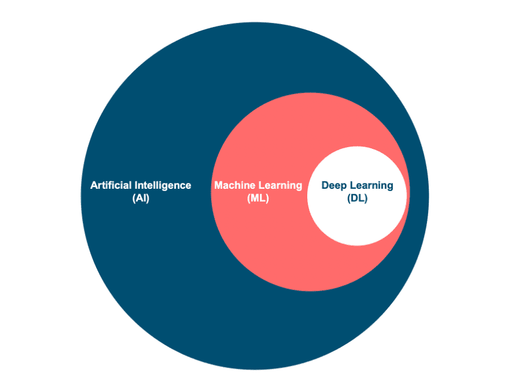

# AI vs ML vs DL (বাংলায় সহজ ব্যাখ্যা)

## 🌟 কৃত্রিম বুদ্ধিমত্তা (AI - Artificial Intelligence)
**AI হল একধরনের প্রযুক্তি, যেখানে মেশিন এমনভাবে কাজ করতে পারে, যেন তা মানুষের মতো চিন্তা করতে পারে।**  
✔️ **উদাহরণ:**  
- গুগল অ্যাসিস্ট্যান্ট / সিরি / অ্যালেক্সা  
- স্বয়ংক্রিয় গাড়ি (Self-driving cars)  
- চ্যাটবট  

---

## 📊 মেশিন লার্নিং (ML - Machine Learning)
**ML হল AI-এর একটি উপশাখা, যেখানে মেশিন নিজেই ডেটা থেকে শেখে এবং সিদ্ধান্ত নেয়।**  
✔️ **উদাহরণ:**  
- ইউটিউব কী ভিডিও সাজেস্ট করবে  
- ইমেইলে স্প্যাম ফিল্টার  
- ব্যাংকের ফ্রড ডিটেকশন  

🔹 **ML তিন ভাগে বিভক্ত:**  
1️⃣ **Supervised Learning** → লেবেলযুক্ত ডেটা ব্যবহার করে শেখে।  
2️⃣ **Unsupervised Learning** → নিজে নিজে প্যাটার্ন খুঁজে বের করে।  
3️⃣ **Reinforcement Learning** → ট্রায়াল-এন্ড-এরর পদ্ধতিতে শেখে।  

---

## 🧠 ডিপ লার্নিং (DL - Deep Learning)
**DL হল ML-এর আরও উন্নত রূপ, যেখানে নিউরাল নেটওয়ার্ক ব্যবহার করে জটিল সমস্যার সমাধান করা হয়।**  
✔️ **উদাহরণ:**  
- চেহারা চিনতে পারা (Face Recognition)  
- মেডিক্যাল ইমেজ বিশ্লেষণ  
- স্বয়ংক্রিয় ভাষান্তর (Google Translate)  

👉 **DL প্রধানত নিউরাল নেটওয়ার্ক (Neural Network) ব্যবহার করে কাজ করে।**  

---

## 🎯 AI vs ML vs DL তুলনামূলক ছক

| ফিচার  | AI | ML | DL |
|--------|----|----|----|
| সংজ্ঞা | মানুষের মতো চিন্তা করা মেশিন | ডেটা থেকে শেখা | নিউরাল নেটওয়ার্ক ব্যবহার করে শেখা |
| ডেটার প্রয়োজনীয়তা | মাঝারি | বেশি | অনেক বেশি |
| কাজের জটিলতা | সহজ থেকে মাঝারি | মাঝারি | জটিল |
| ব্যবহার | চ্যাটবট, রোবটিক্স | স্প্যাম ফিল্টার, সুপারিশ ব্যবস্থা | চিত্র শনাক্তকরণ, স্বয়ংক্রিয় গাড়ি |
